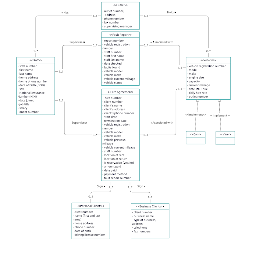

# Database Implementation for a Car Rental Company

This project was done as part of the YSC3263 Database Management Systems class. 

## Basiness Task: 
With the growth of its business and the number of its outlets, a car rental company Smiles has been facing poor data management and inefficient data flow between its branches. Create a database software for the car rental company Smiles to manage all its data on clients, vehicles, staff and rental contracts. 

## Solution:
We create a database in MySQL workbench using an appropriate schema that we develop based on the information provided about the business. As this is a fictional business, we create mock data for each of the tables, which is stored in the src folder. SQL queries used to populate and modify data is stored in the sql folder. 

